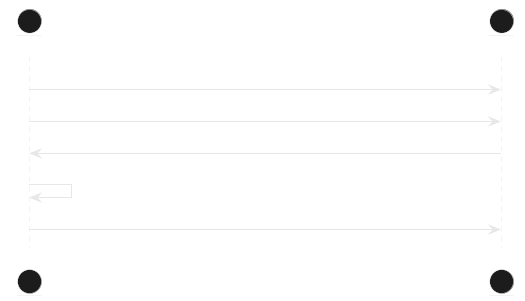

# Topic 'lifetime'

Topic 'lifetime' responsible about time between publishing statuses



By default lifetime is set to 60 sec

Example:

```
[1698845947] <48:3f:da:55:07:5b/3996365522/status 0
...30 messages
[1698846007] <48:3f:da:55:07:5b/3996365522/status 30
[1698846008] >48:3f:da:55:07:5b/lifetime 120
[1698846127] <48:3f:da:55:07:5b/3996365522/status 30 
```